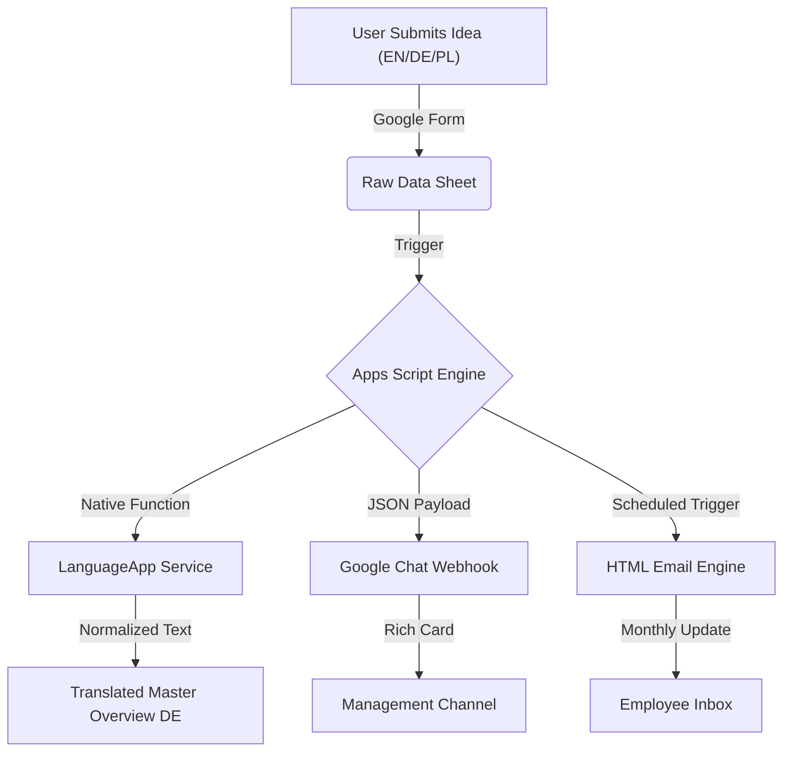
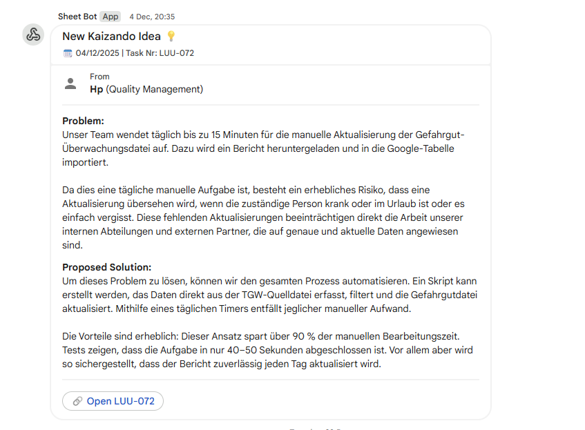
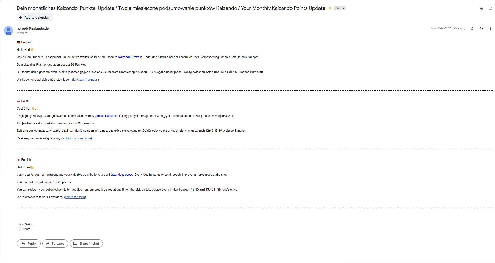

# Kaizando: Automated Continuous Improvement System 🚀

  

## 📖 Executive Summary
**Kaizando** (a portmanteau of *Kaizen* and *Zalando*) is an internal operational excellence tool designed to crowd-source process improvement ideas from frontline employees.

Previously, this process was manual, prone to delays, and suffered from language barriers across the diverse workforce (English, German, Polish). I engineered a **full-stack automation solution** using Google Ecosystem tools that automates data ingestion, translation, notification, and gamification.

---

## 🧐 The Challenge
The Quality Management team faced three specific bottlenecks:
1.  **Language Barrier:** Ideas submitted in Polish or English required manual translation for the German-speaking decision board.
2.  **Latency:** Managers had to manually check spreadsheets to find new entries, slowing down implementation.
3.  **Engagement:** Employees lacked visibility into their "Reward Points," leading to lower participation rates.

---

## ⚙️ Solution Architecture

I designed an automated pipeline using **Google Apps Script (GAS)** as the backend engine.


---

## 📸 Key Features & Visuals

### 1. Real-Time "Rich Card" Notifications
Replacing boring email alerts, I implemented **JSON Webhooks** to push "Rich Cards" to Google Chat. This allows managers to see the **Problem** and **Proposed Solution** instantly without opening the database.



*Automated alert sent to the Quality Management channel immediately upon submission.*

### 2. Monthly Gamification Reports (HTML)
To boost engagement, the system runs a monthly cron job that sends personalized HTML emails to employees, displaying their current reward points balance and greeting them in their native language.


*Dynamic HTML email with conditional formatting based on user data.*

---

## 💻 Technical Implementation

### 1. The Notification Engine (JSON Webhook)
This script constructs a `CardV2` JSON object and posts it to the Google Chat API. This ensures the notification looks like a native app widget rather than a plain text message.

```javascript
function sendChatNotification(ticketNum, problem, solution) {
  var webhookUrl = "YOUR_WEBHOOK_URL_HERE";
  
  // Constructing the Card Payload
  var payload = {
    "cardsV2": [{
      "cardId": "unique-id-" + ticketNum,
      "card": {
        "header": {
          "title": "Neue Kaizando Idee 💡",
          "subtitle": "Task Nr: LUU-" + ticketNum
        },
        "sections": [{
          "widgets": [
            {
              "textParagraph": {
                "text": "<b>Problem:</b><br>" + problem
              }
            },
            {
              "buttonList": {
                "buttons": [{
                  "text": "🔗 Open Task",
                  "onClick": { "openLink": { "url": rowUrl } }
                }]
              }
            }
          ]
        }]
      }
    }]
  };

  // Sending the POST request
  UrlFetchApp.fetch(webhookUrl, {
    "method": "post",
    "contentType": "application/json",
    "payload": JSON.stringify(payload)
  });
}
```

### 2. The Auto-Translation Middleware
To ensure data consistency, this script acts as middleware. It detects non-empty cells in the source columns and calls the `LanguageApp` class to normalize text to German (`de`).

```javascript
function translateOverviewColumns() {
  // Logic to detect source language and translate to German
  if (sourceProb !== "") {
    try {
      var transProb = LanguageApp.translate(sourceProb, "", "de");
      var transSol = LanguageApp.translate(sourceSol, "", "de");
      
      // Updates the Master Sheet with the translated text
      sheet.getRange(row, targetCol).setValue(transProb);
    } catch (e) {
      console.error("Translation API Error: " + e);
    }
  }
}
```

### 3. Dynamic HTML Email Generation
I used template literals to inject user data (Name, Points) into an HTML structure, enabling a professional, branded email experience.

```javascript
// Parsing logic to humanize the email greeting
var namePart = emailAddress.split('@')[0]; 
var firstName = namePart.charAt(0).toUpperCase() + namePart.slice(1);

// HTML Template
var emailBody = `
  <p>Hallo ${firstName}👋,</p>
  <p>Vielen Dank für deinen Beitrag!</p>
  <p>Dein aktuelles Prämienguthaben beträgt <b style="color: #0000FF;">${points} Punkte.</b></p>
  <hr>
  <p>Keep the ideas coming!</p>
`;

GmailApp.sendEmail(emailAddress, subject, "Fallback Text", { htmlBody: emailBody });
```

---

## 🚀 Results & Impact
* **90% Reduction in Admin Time:** Automated the manual translation and data entry, saving the team ~15 minutes per day.
* **Zero Latency:** Shifted from "Daily Checks" to "Instant Notifications," allowing for immediate feedback on urgent safety or process ideas.
* **Scalability:** The system handles inputs from 3 different languages and consolidates them into a single source of truth without human intervention.
