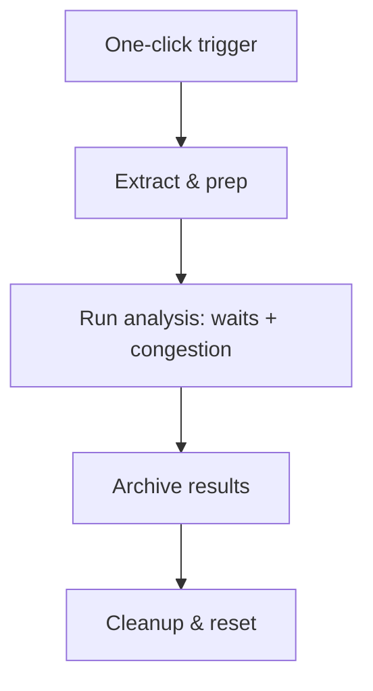

# order-duration-efficiency-analysis

A one-click Google Apps Script analysis that quantified why palletization
workstations were stalling during order fulfilment. The hypothesis was that the
automated storage system (AKL) was deprioritising urgent order cartons behind
routine stock movements; this tool produced the data to test it.

## What it does

Joins three OLAP sources to build an end-to-end picture per order:

- **Order release logs** — when an order was requested.
- **Workstation scans** — carton arrival and operator throughput.
- **System-wide transport logs** — all automated movements in the facility.

From these it derives:

- **Initial wait** — order release → first carton scan.
- **Total processing** — first scan → last scan.
- **Congestion** — count of concurrent non-order transports within each order's
  active window, as a measure of system load.

## How it runs



The script uses the spreadsheet itself as the store, moving data
Source → Staging → Archive so each run is repeatable.

## Project layout

```
order-duration-efficiency-analysis/
├── order_transport_duration_analysis.js   # the 4-step ETL + analysis
└── README.md
```

## Outcome

The analysis showed a positive correlation between high background transport
volume and longer order durations — evidence that the system treated urgent
cartons no differently from routine moves. That supported a change to the
warehouse control system (WCS) to prioritise order-carton retrieval.

## Setup

Bound Apps Script on the analysis spreadsheet. Point the source ranges at your
OLAP export tabs and add the menu/trigger that calls the entry function. Source
queries hit the internal OLAP database; run over a bounded date range.
