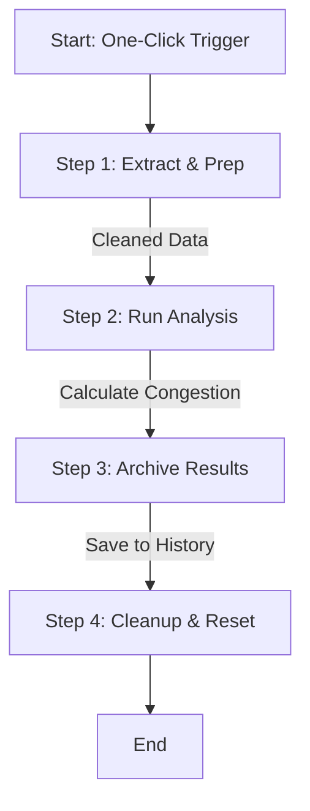

# Warehouse Order & Transport Efficiency Analysis

## 📌 Project Overview
Palletization workstations in the warehouse were experiencing significant, unexplained delays during order fulfillment. The working hypothesis was that the automated storage loading machine (AKL) was failing to prioritize critical order cartons, instead getting "clogged" by routine, low-priority stock movements.

**Objective:** To quantify the delays, identify the root cause, and determine if system congestion was negatively impacting order processing speed.

## ⚙️ Technical Solution

### 1. Data Integration Strategy
To build a holistic view of the warehouse operations, I queried the internal OLAP database to extract and merge data from three distinct sources:
* **Order Release Logs:** Timestamps for when an order was requested.
* **Workstation Scan Data:** Granular tracking of operator speed and carton arrival.
* **System-Wide Transport Logs:** A record of all automated movements within the facility.

### 2. Automation via Google Apps Script
I developed a "one-click" Google Apps Script solution to automate the ETL (Extract, Transform, Load) and analysis process. The script performs the following operations:
* **Data Retrieval:** Fetches raw datasets from the connected sources.
* **KPI Calculation:**
    * **Initial Wait Time:** Duration from *Order Release* → *First Carton Scan*.
    * **Total Processing Time:** Duration from *First Scan* → *Last Scan*.
* **Congestion Logic:** For every specific order window, the script identifies and counts concurrent "Active Transports" (non-order-related movements) to measure system load.

## 💻 Automation Script Structure

To automate the analysis, I wrote a Google Apps Script that functions as a 4-step ETL (Extract, Transform, Load) pipeline.

### Workflow Logic
The script executes sequentially to ensure data integrity. It uses the spreadsheet itself as a database, moving data from **Source** → **Staging** → **Archive**.

## 🚀 Impact & Results

The analysis provided conclusive evidence regarding the root cause of the delays:

* **Insight:** There was a strong positive correlation between high volumes of background "active transports" and increased order duration.
* **Root Cause:** The data proved the system lacked prioritization logic; it treated urgent shipping cartons with the same weight as routine stock movements.
* **Actionable Outcome:** Armed with this data, management updated the Warehouse Control System (WCS) logic.
* **Result:** Retrieval of shipping cartons is now a **high-priority task**, resulting in measurable improvements in workstation throughput and reduced idle time.

---

### 🛠 Tools Used
* **SQL / OLAP:** Data querying and extraction.
* **Google Apps Script:** Automation and data processing.
* **Spreadsheet Modeling:** KPI definition and reporting.
