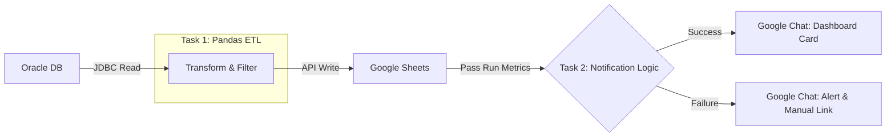
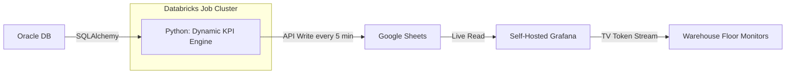

# ⚡ Databricks Pipelines: Automated ETL & Real-Time KPI Dashboard


## 📋 Summary

Two production Databricks pipelines running daily at Ludwigsfelde (LUU) warehouse:

| Pipeline | Problem | Result |
| :--- | :--- | :--- |
| [🚀 Oracle → Google Sheets ETL](#-pipeline-1-oracle--google-sheets-etl) | 100 min/day manual report extraction from 700MB source → browser crashes, stale data | **<10 min/day** · Fully autonomous · Adaptive ChatOps alerts |
| [📊 Real-Time KPI TV Dashboard](#-pipeline-2-real-time-kpi-tv-dashboard) | No floor visibility into transport KPIs · €10K+ vendor proposals | **Saved €10K** · **<€70/month** infra · Zero-credential TV monitors |

---

## 🚀 Pipeline 1: Oracle → Google Sheets ETL

**Powers the [DG Monitor Dashboard](https://github.com/Hari-prasanna/BI-Tools-Projects/blob/main/LUU-DG-Monitor/README.md)** — ensures 20-Liter dangerous goods threshold compliance.



### Technical Highlights

- **Query Pushdown:** Parameterized SQL (`:category`) pushed to Oracle via SQLAlchemy — extracts ~10,000 relevant rows from a 700MB source
- **Vectorized Cleaning:** Pandas `.str.match(r'^\d')` for regex-based data cleaning before Google Sheets API write
- **Multi-Task Orchestration:** Task 1 (ETL) → Task 2 (Notifier) via `dbutils.jobs.taskValues`, fetching `row_count` and `status` dynamically
- **Adaptive ChatOps:** Google Chat Cards V2 — success shows Run Time + Rows Processed with dashboard link; failure shows alert with manual fallback link

### Schedule

```cron
0 0 5,15 * * ?  # Runs daily at 05:00 and 15:00 Berlin Time
```

---

## 📊 Pipeline 2: Real-Time KPI TV Dashboard




### Technical Highlights

- **Zero-Maintenance KPI Engine:** Auto-discovers `.sql` files in `SQL_FOLDER` — file name becomes column header. Adding a KPI = dropping a `.sql` file, zero code changes
- **Cost-Optimized Loop:** `while True` + `time.sleep(300)` updates every 5 min. `pytz` detects end of final shift (11:30 PM Berlin) → auto-shutdown overnight to save DBUs
- **Minimal Resources:** <70% memory, <60% CPU minutes on average
- **Zero-Credential Visualization:** Grafana reads Google Sheets directly → streams to TV monitors via credential-less TV tokens

### Impact by Role

- **Site Leads:** Instant transparency (e.g., 2 open orders, 45 open positions at a glance)
- **Team Leads:** Dynamic workload distribution based on live traffic
- **Employees:** Passive awareness from floor monitors — no logins, no walkie-talkies

---

## ⚙️ Setup (Shared)

### Configuration

1. Copy `config.template.json` → `config.json` (gitignored)
2. Update file paths and Sheet IDs for your Databricks workspace

### Secrets (Databricks CLI)

> ⚠️ **Linux/Mac:** Wrap values with special characters (`&`, `?`) in single quotes — terminal truncates otherwise.

```bash
# Pipeline 1: ETL
databricks secrets create-scope luu_qm_secrets
databricks secrets put-secret luu_qm_secrets chat_webhook_url --string-value '<WEBHOOK_URL>'
databricks secrets put-secret luu_qm_secrets oracle_auth --string-value '{"user":"<USER>","password":"<PASS>","host":"<HOST>","port":"<PORT>","service":"<SERVICE>"}'
databricks secrets put-secret luu_qm_secrets google_auth --string-value '<SERVICE_ACCOUNT_JSON>'

# Pipeline 2: KPI Dashboard
databricks secrets create-scope luu_transport_secrets
databricks secrets put-secret luu_transport_secrets oracle_auth --string-value '{"user":"<USER>","password":"<PASS>","host":"<HOST>","port":"<PORT>","service":"<SERVICE>"}'
databricks secrets put-secret luu_transport_secrets google_auth --string-value '<SERVICE_ACCOUNT_JSON>'
```