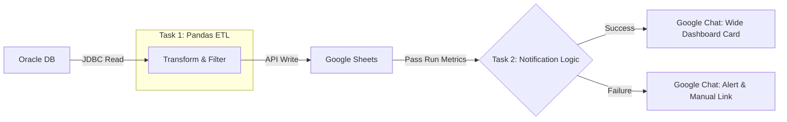

# 🚀 Oracle to Google Sheets: ETL Pipeline


## 📋 Project Context: The Challenge

**Situation:** Warehouse operations teams at Ludwigsfelde (LUU) were spending **100 minutes per day** manually extracting heavy reports (>70MB) from the legacy TGW Infosystem and importing to Google-sheets to track dangerous goods.

**The Pain Points:**

* **Operational Bottleneck:** Manual data retrieval was repetitive and delayed critical decision-making at shift starts.
* **Scalability Issues:** Importing large datasets directly into Google Sheets caused browser crashes and exceeded AppScript execution limits.
* **Lack of Visibility:** If a manual update was missed, stakeholders worked with stale data without knowing it.

## 💡 The Solution

I engineered a **Databricks-based ETL pipeline** using **Python and Pandas** for fast, in-memory processing and **Task Orchestration** for reliability. The system queries the Oracle database directly using SQLAlchemy, processes the data cleanly in the cloud, and pushes only the necessary insights to the dashboard.

### 🏗️ Architecture & Workflow

The pipeline utilizes **Databricks Workflows** to manage dependencies. The notification task *only* runs after the ETL task completes, inheriting the run metrics.



## 📈 Key Results & Business Impact

| Metric | Before (Manual) | After (Automated) |
| :--- | :--- | :--- |
| **Update Time** | 100 mins/day | **< 10 mins/day** |
| **Reliability** | Prone to human error | **99.9% Uptime** |
| **Data Freshness** | Stale by hours | **Real-time (Shift start)** |
| **Manual Effort** | High (Repetitive) | **Zero (Fully Autonomous)** |

* **Impact:** Powered the [DG Monitor Dashboard](https://github.com/Hari-prasanna/BI-Tools-Projects/blob/main/LUU-DG-Monitor/README.md), ensuring strict adherence to the 20-Liter threshold for dangerous goods storage.

## 🛠️ Technical Deep Dive

### 1. Memory-Optimized Extraction & Processing (Pandas & SQLAlchemy)
The legacy system struggled with the raw source data (approx. 700MB per shift), which frequently caused browser crashes and AppScript timeouts. I engineered an optimized, in-memory Python pipeline to solve this.

* **Query Pushdown:** Instead of loading the entire 700MB dataset into memory, I leveraged `SQLAlchemy` to pass parameterized SQL queries (`:category`) directly to the Oracle engine. By pushing the filtering logic down to the database level, the pipeline only extracts the ~10,000 highly relevant rows over the network, drastically reducing memory overhead and execution time.
* **Vectorized Transformations:** Once the optimized payload hits the Databricks Driver, the script uses Pandas vectorized string operations (`.str.match(r'^\d')`) for lightning-fast regex data cleaning before writing to the Google Sheets API.

### 2. Job Orchestration & Dependencies

The pipeline is not just a script; it is a **multi-task workflow**:

* **Task 1 (ETL):** Handles the heavy lifting. If this fails, the workflow stops immediately to prevent bad data load.
* **Task 2 (Notifier):** A dependent task that utilizes `dbutils.jobs.taskValues`. It dynamically fetches the `row_count` and `status` from the previous task context to generate the report.

### 3. Adaptive "ChatOps" Notification System

I developed a custom notification script using **Google Chat Cards V2** that adapts the UI based on the job status:

* **✅ Success State (Horizontal Layout):**
    * Uses a **Column Widget** to display "Run Time" and "Rows Processed" side-by-side for quick scanning.
    * **Action:** Direct link to the Looker Studio Dashboard.
* **❌ Failure State (Alert Layout):**
    * Displays error headers and a warning icon.
    * **Action:** Provides a "Call to Action" button linking to the **Manual Import Sheet**, ensuring operations can continue even if the automation fails.

## ⚙️ Setup & Configuration

### 1. Environment & Scheduling

* **Workspace:** Databricks Workspace (Standard/Premium) with a Spark Cluster (Runtime 12.2 LTS or higher).
* **Scheduling:** Cron schedule configured for specific shift handovers:

    ```cron
    0 0 5,15 * * ?  # Runs daily at 05:00 and 15:00 Berlin Time
    ```

### 2. Configuration Management

This project uses parameterized configurations.

1. Duplicate the `config.template.json` file and rename it to `config.json`.
2. Update the file paths and Sheet IDs to match your local Databricks workspace environment.

> **Note:** `config.json` is included in `.gitignore` to prevent leaking personal workspace paths.

### 3. Secrets Management (CLI Setup)

Sensitive credentials are not hardcoded. You must configure your Databricks Secrets using the **Databricks CLI** before running the pipeline.

**Create the Scope:**

```bash
databricks secrets create-scope luu_qm_secrets
```

**Add the Secrets:**

> ⚠️ **CRITICAL WARNING FOR LINUX/MAC USERS:** When pasting URLs or passwords that contain special characters (like `&` or `?`), you **MUST** wrap the value in single quotes (`'`). If you do not, the terminal will truncate the string and the script will fail.

```bash
# Google Chat Webhook
databricks secrets put-secret luu_qm_secrets chat_webhook_url \
  --string-value '<YOUR_FULL_WEBHOOK_URL_HERE>'

# Oracle Database Credentials
databricks secrets put-secret luu_qm_secrets oracle_auth \
  --string-value '{"user":"<USER>","password":"<PASS>","host":"<HOST>","port":"<PORT>","service":"<SERVICE>"}'

# Google Service Account JSON
databricks secrets put-secret luu_qm_secrets google_auth \
  --string-value '<YOUR_ENTIRE_GOOGLE_SERVICE_ACCOUNT_JSON_HERE>'
```
