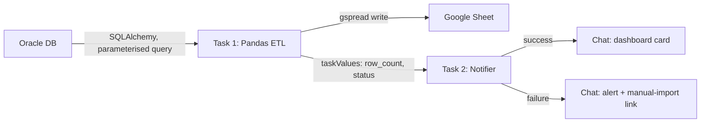

# oracle-to-looker-etl

Extracts dangerous-goods (DG) stock data from the Oracle warehouse system,
cleans it in Pandas, and writes the result to the Google Sheet that backs the
DG Monitor Looker Studio dashboard. A second task posts the run summary to
Google Chat.

This replaced a manual routine where operators exported a large report
(~70 MB+) from the legacy TGW Infosystem and pasted it into a Sheet by hand
each shift — slow, error-prone, and prone to browser/Apps Script limits on the
import side.

## How it works



- **Query pushdown.** The category filter is passed to Oracle as a bound
  parameter (`:category`), so only the relevant rows (~10k) come over the wire
  instead of the full source.
- **Vectorised cleaning.** Pandas string operations (e.g. `.str.match(r'^\d')`)
  do the row filtering before the Sheet write.
- **Two tasks.** `ETL_Task` runs the extract/load; `Notify_Task` depends on it
  and reads `row_count`/`status` from `dbutils.jobs.taskValues` to build the
  Chat card. If the ETL fails, the workflow stops before loading bad data.

## Project layout

```
oracle-to-looker-etl/
├── databricks.yml              # bundle: schedule, tasks, targets
├── requirements.txt
└── src/
    ├── etl_pipeline.py         # Task 1 — extract, clean, write to Sheets
    ├── notification_sender.py  # Task 2 — Google Chat success/failure card
    ├── zal_bestand_query.sql   # the parameterised Oracle query
    ├── config.template.json    # copy to config.json (gitignored)
    └── config.json             # Sheet IDs + dashboard links (local only)
```

## Configuration

```bash
cp src/config.template.json src/config.json
# then set sheet_id, the tab names, and the dashboard/manual links
```

`category` is supplied per run as a job widget (default `Beauty`).

## Secrets

Stored in the `luu_qm_secrets` scope:

```bash
databricks secrets create-scope luu_qm_secrets
databricks secrets put-secret luu_qm_secrets chat_webhook_url --string-value '<WEBHOOK_URL>'
databricks secrets put-secret luu_qm_secrets oracle_auth --string-value '{"user":"<USER>","password":"<PASS>","host":"<HOST>","port":"<PORT>","service":"<SERVICE>"}'
databricks secrets put-secret luu_qm_secrets google_auth --string-value '<SERVICE_ACCOUNT_JSON>'
```

## Deploy & run

```bash
databricks bundle validate -t dev
databricks bundle deploy   -t dev
databricks bundle run luu_beauty_stock_update -t dev
```

Schedule: `0 40 5,14 ? * MON-FRI` (Europe/Berlin), shipped `PAUSED` on dev.

## Troubleshooting

- **Chat card never arrives but the Sheet updated.** The ETL succeeded and the
  notifier failed — check `chat_webhook_url` in the scope and `Notify_Task` logs.
- **Secret value looks truncated.** Re-add it wrapped in single quotes; `&`/`?`
  in URLs get cut by the shell otherwise.
- **Stale data downstream.** Confirm the job ran (it's paused by default on dev)
  and that the dashboard points at the `sheet_id` in `config.json`.
