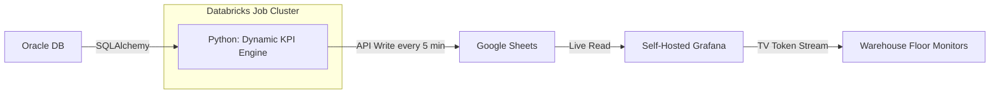
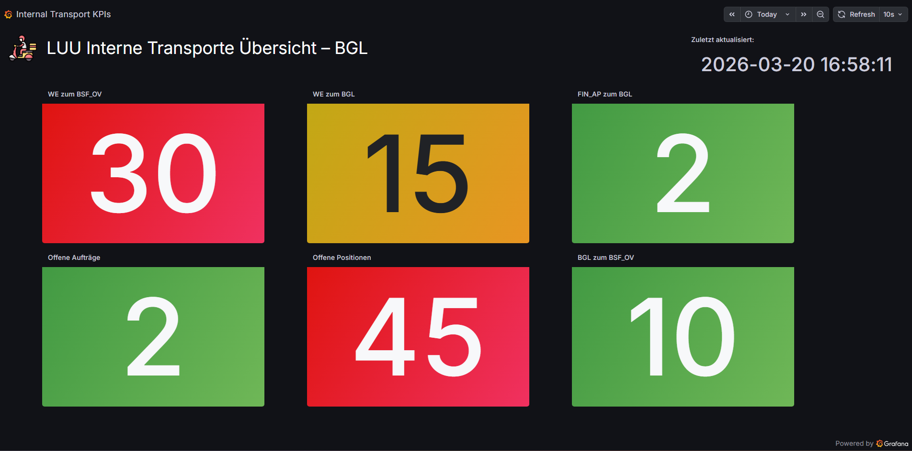

# 📊 Internal Transport: Real-Time KPI Dashboard


## 📋 Project Context: The Challenge

**Situation:** The warehouse floor at Ludwigsfelde (LUU) relied on a manual, CSV-driven reporting process for internal transport KPIs. Site leads, team leads, and employees had no real-time visibility into open orders or transport volumes without logging into shared laptops or monitoring walkie-talkies.

**The Pain Points:**

* **No Floor Visibility:** There was no passive, at-a-glance way for employees to see pending tasks or live transport volumes.
* **Delayed Decision-Making:** Team leads distributed workloads based on stale, delayed reports instead of live traffic data.
* **High Vendor Costs:** External vendor proposals for a real-time dashboard solution were estimated at **€10,000+** in implementation costs alone.

## 💡 The Solution

I architected a **real-time, zero-credential TV dashboard** using **Databricks**, **Google Sheets** as a free intermediary database, and a **self-hosted Grafana** instance. By building this entirely in-house, we bypassed external vendor proposals, saving an estimated **€10,000 in implementation costs** while keeping ongoing cloud infrastructure expenses to **under €70/month**.

### 🏗️ Architecture & Workflow

The pipeline is designed to be highly resilient, extremely cost-effective, and fully dynamic. The Databricks job pushes KPI integers to Google Sheets every 5 minutes, which Grafana reads and streams to floor monitors.



## 📺 Dashboard Preview
 


## 📈 Key Results & Business Impact

| Metric | Before (Manual) | After (Automated) |
| :--- | :--- | :--- |
| **Implementation Cost** | €10,000+ (Vendor) | **€0 (Built In-House)** |
| **Monthly Infra Cost** | N/A | **< €70/month** |
| **Data Freshness** | Stale CSV reports | **Live (5-min intervals)** |
| **Floor Visibility** | None (laptop/walkie-talkie) | **Passive TV Monitors** |
| **Adding New KPIs** | Code changes required | **Drop a .sql file** |

**Impact by Role:**

* **Site Leads:** Gain instant, high-level transparency into operations (e.g., seeing exactly when there are 2 open orders and 45 open positions).
* **Team Leads:** Can dynamically and immediately distribute workloads based on live traffic rather than delayed reports.
* **Employees:** Gain passive awareness of pending tasks and transport volumes just by looking at the floor monitors, entirely eliminating the need to monitor walkie-talkies or log into shared laptops.

## 🛠️ Technical Deep Dive

### 1. Dynamic KPI Generation (Zero-Maintenance Engine)

The Python script is designed to be **future-proof and maintenance-free**. It does not hardcode any SQL queries. Instead, it targets a specific directory (`SQL_FOLDER`).

* **Auto-Discovery:** Any `.sql` file dropped into the folder is automatically detected on the next cycle.
* **Convention-Based Naming:** The script uses the **file name** as the column header in Google Sheets (e.g., `open_orders.sql` → `open_orders` column).
* **Single-Value Extraction:** Each query is executed against Oracle, the single KPI integer is extracted, and it is appended to the results array.
* **Zero Code Changes:** To add a new KPI to the dashboard, a developer simply drops a new `.sql` file into the folder—no Python code changes are required.

### 2. Cost-Optimized Compute Loop

The Databricks cluster is heavily tuned for cost efficiency:

* **Minimal Resource Usage:** Operates on average using **>70% of memory** and **>60% used CPU minutes**.
* **5-Minute Intervals:** The script utilizes a `while True` loop with a `time.sleep(300)` pause, updating the Google Sheet exactly every 5 minutes.
* **Automated Shutdown:** Using the `pytz` library for Berlin local time, the loop detects the end of the final shift (**11:30 PM**) and intentionally breaks the loop, safely shutting down the compute resources overnight to save DBUs.

### 3. Zero-Credential Visualization (Self-Hosted Grafana)

A self-hosted Grafana instance provides the visualization layer, purpose-built for warehouse floor displays:

* **Google Sheets as a Data Source:** Grafana reads KPI values directly from the Google Sheet, turning it into an instantly updating intermediary database at zero cost.
* **TV Token Streaming:** Monitors on the warehouse floor use secure, **credential-less TV tokens**—no login required, no credentials exposed on shared screens.

## ⚙️ Setup & Configuration

### 1. Environment

* **Compute:** Databricks Workspace (Standard/Premium) with a minimal job cluster, tuned for low resource consumption.
* **Visualization:** Self-hosted Grafana instance with the Google Sheets data source plugin.
* **Intermediary:** A Google Sheet acting as the live KPI database.

### 2. Adding a New KPI

1. Write a standard SQL query that outputs a single number (e.g., `COUNT(*)`).
2. Save it as a `.sql` file (e.g., `open_orders.sql`).
3. Upload it to the designated Databricks `SQL_FOLDER`.
4. The script will automatically pick it up on its next 5-minute cycle and push the new column to Google Sheets.
5. Add the new panel in Grafana pointing to the new column.

### 3. Secrets Management (CLI Setup)

Sensitive credentials are stored safely in **Databricks Vault**. Configure them using the **Databricks CLI** before running the pipeline.

**Create the Scope:**

```bash
databricks secrets create-scope luu_transport_secrets
```

**Add the Secrets:**

> ⚠️ **CRITICAL WARNING FOR LINUX/MAC USERS:** When pasting URLs or passwords that contain special characters (like `&` or `?`), you **MUST** wrap the value in single quotes (`'`). If you do not, the terminal will truncate the string and the script will fail.

```bash
# Oracle Database Credentials
databricks secrets put-secret luu_transport_secrets oracle_auth \
  --string-value '{"user":"<USER>","password":"<PASS>","host":"<HOST>","port":"<PORT>","service":"<SERVICE>"}'

# Google Service Account JSON
databricks secrets put-secret luu_transport_secrets google_auth \
  --string-value '<YOUR_ENTIRE_GOOGLE_SERVICE_ACCOUNT_JSON_HERE>'
```
