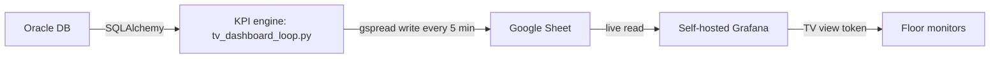

# realtime-data-stream

A near-real-time KPI dashboard for the internal-transport floor. A Databricks job
runs a set of Oracle queries every 5 minutes and writes the values to a Google
Sheet; a self-hosted Grafana instance reads that Sheet and streams it to the
warehouse floor TVs over credential-less view tokens.

It replaced a manual CSV reporting routine and avoided an external vendor build,
keeping ongoing infra cost low by reusing a Sheet as the intermediary store
instead of a hosted database.

## How it works




- **Convention-based KPIs.** The script scans `transport_kpis_queries/` and runs
  every `.sql` file it finds. The file name becomes the Sheet column header
  (`open_orders.sql` → `open_orders`). Each query returns a single number.
  Adding a KPI = dropping a `.sql` file; no Python change.
- **Cost-aware loop.** A `while True` loop with `time.sleep(300)` refreshes every
  5 minutes. Using `pytz`, the loop detects the end of the last shift
  (≈23:30 Berlin) and exits so the cluster can shut down overnight.

See [`data_dict/Historie_v.md`](data_dict/Historie_v.md) for the column/business
logic behind the KPI queries (event-type IDs, lifecycle grouping, etc.).

## Project layout

```
realtime-data-stream/
├── requirements.txt
├── data_dict/Historie_v.md         # data dictionary for the source view
├── assets/Transport_kpis.png       # dashboard screenshot
├── src/tv_dashboard_loop.py        # the 5-minute KPI engine
└── transport_kpis_queries/         # one .sql per KPI (file name = column)
    ├── open_orders.sql
    ├── open_positions_bgl.sql
    ├── BGL-BSF_OV.sql
    ├── WE-BGL.sql
    ├── WE-BSF_OV.sql
    └── FIN_AP-BGL.sql
```

## Configuration

`tv_dashboard_loop.py` has placeholders to set before running:

- `SHEET_ID`, `TAB_NAME` — the target Sheet and tab.
- `SQL_FOLDER` — path to `transport_kpis_queries/` on the workspace.

## Secrets

Stored in the `luu_qm_secrets` scope (`oracle_auth`, `google_auth`); see the
[oracle-to-looker-etl README](../oracle-to-looker-etl/README.md#secrets) for the
exact `put-secret` commands.

## Adding a KPI

1. Write a query that returns one value (e.g. `SELECT COUNT(*) ...`).
2. Save it as `<column_name>.sql` in `transport_kpis_queries/`.
3. The loop picks it up on the next cycle and writes a new column.
4. Add a panel in Grafana pointing at that column.

## Troubleshooting

- **A column stopped updating.** Run that single `.sql` against Oracle — a query
  that errors or returns multiple rows breaks just its own column.
- **TVs show stale numbers.** Confirm the loop is still running (it intentionally
  exits after the last shift) and that Grafana points at the right Sheet/tab.
