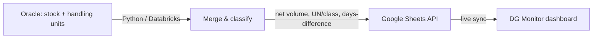

# dg-compliance-pipeline (DG Monitor)

Dangerous-goods compliance monitor for the LUU site. A Python/Databricks job
pulls stock and handling-unit data from Oracle, applies regulatory
classification, and publishes a live Looker Studio dashboard so the outlet and
compliance teams can keep hazardous volumes under their storage thresholds.

The upstream extract/load is the
[oracle-to-looker-etl](../../databricks-pipelines/oracle-to-looker-etl) pipeline;
this folder documents the dashboard and the compliance logic on top of it.

## How it works

- **Extract.** Queries two Oracle sources for raw stock and handling-unit data.
- **Transform.** Merges them, applies UN-number classification, and computes net
  volume per location.
- **Forecast.** A "days difference" (DD) metric estimates when an item will
  approach its limit, flagging it for priority removal before a breach.

## Dashboard

- Drill-down from total volume → handling unit (carton) → SKU.
- Volumes broken out by hazard class (e.g. 2.1 vs 3) and UN number
  (e.g. UN 1950 aerosols), which is what the legal storage limits key on.
- A side table highlights stock age and flags high-DD items for "stock picked"
  prioritisation.

## Notes

The dashboard is published in Looker Studio and reads from the Google Sheet that
`oracle-to-looker-etl` maintains. To change what the dashboard shows, adjust the
extract/clean logic in that pipeline; this folder holds the documentation and
screenshot for the compliance view.
