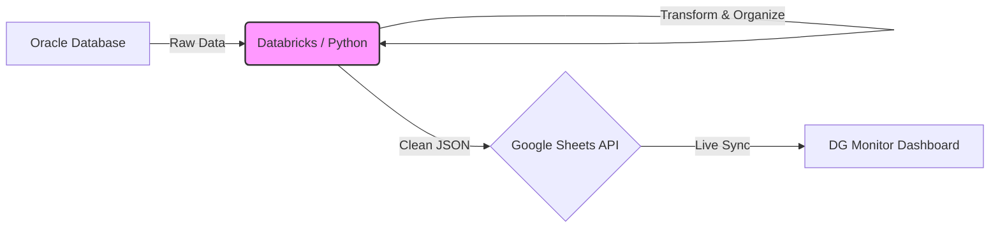
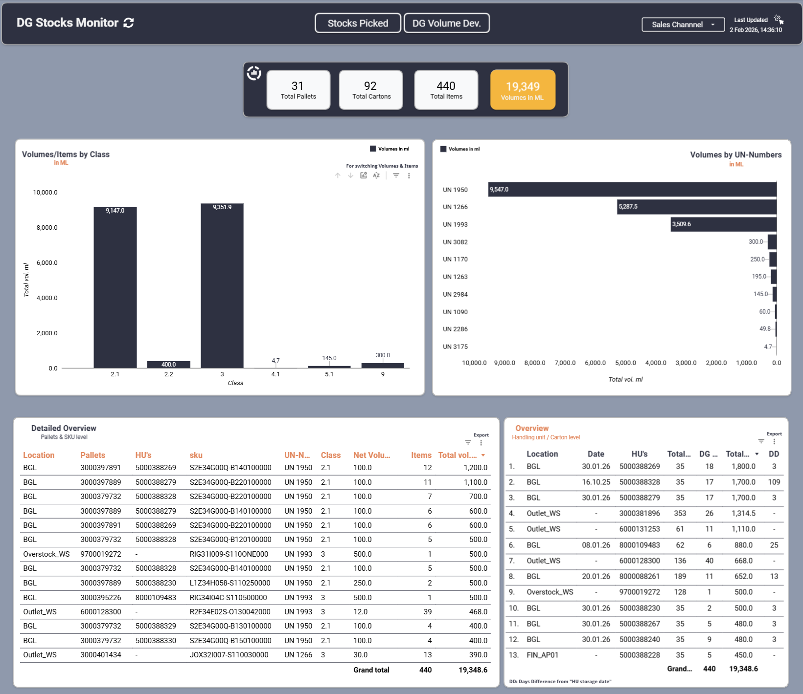

# LUU DG Monitor: Automated Hazardous Compliance Pipeline

## 📌 Project Overview
The **Dangerous Goods (DG) Monitor** is a safety-critical analytics solution designed to manage hazardous inventory at the Ludwigsfelde warehouse.

Managing hazardous materials requires strict adherence to volume thresholds (e.g., <20 Liters for specific zones). Previously, tracking this required manual data merging, leading to stale data and compliance risks.

**Objective:** I built an automated ETL pipeline and forecasting dashboard to provide real-time visibility into DG stocks, ensuring regulatory compliance and streamlining outlet prioritization.

## 🏗️ The Automated Pipeline (ETL)
To solve the latency of manual reporting, I migrated the data processing to a cloud-based automated pipeline.

* **Extraction:** An automated Python script queries two separate Oracle sources to pull raw stock and handling unit data.
* **Transformation:** The system merges these sources, applies regulatory logic (UN-Number classification), and calculates "Net Volume" per location.
* **Forecasting Logic:** The script calculates a "Days Difference" (DD) metric to predict when items will become critical, flagging them for priority removal before they breach compliance limits.

### 📊 The Dashboard & Features

The frontend provides a "Control Tower" view for the Outlet and Compliance teams.

**Key Features**
* **Granular Visibility:** Users can drill down from high-level "Total Volume" (19,349 Liters) to specific Handling Units (cartons) and SKU levels.
* **Class & UN Tracking:** The dashboard visualizes volumes by Hazard Class (e.g., Class 2.1 vs 3) and specific UN Numbers (e.g., UN 1950 Aerosols), which is critical for legal storage limits.
* **Automated Alerts:** The table on the right highlights stock age and flags high-risk items, allowing teams to prioritize "Stock Picked" tasks effectively based on the Days Difference (DD) metric.

### 🚀 Impact & Results

* **Risk Mitigation:** Automated alerts prevent threshold breaches, ensuring 100% compliance with safety regulations.
* **Operational Efficiency:** Replaced a manual, reactive process with a proactive forecasting model, allowing teams to plan stock movements in advance.
* **Unified View:** Successfully consolidated disparate data sources into a single source of truth for the entire site.
