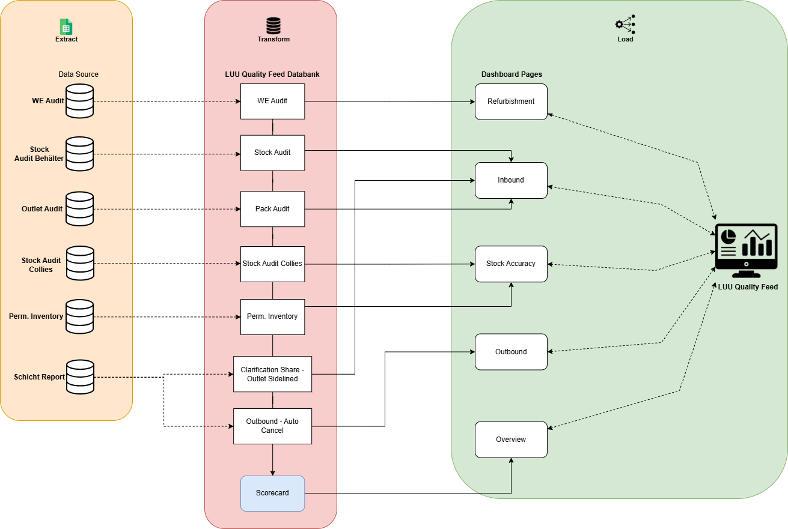
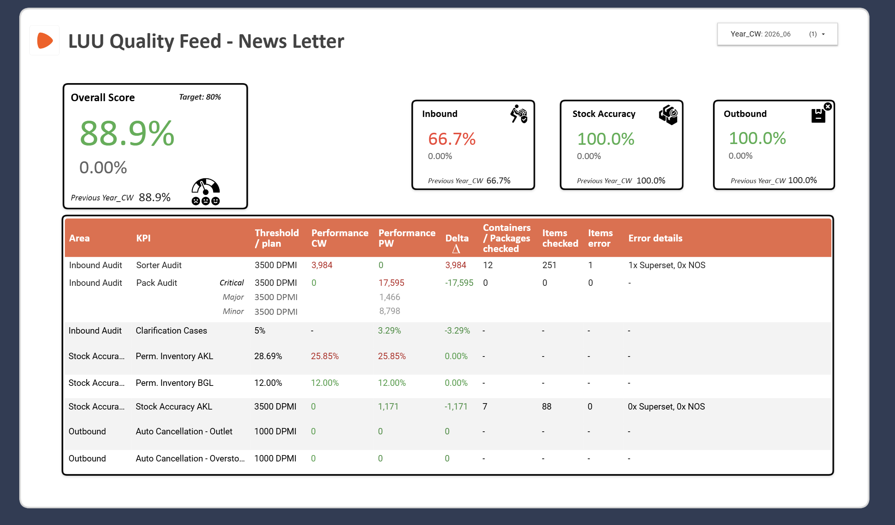
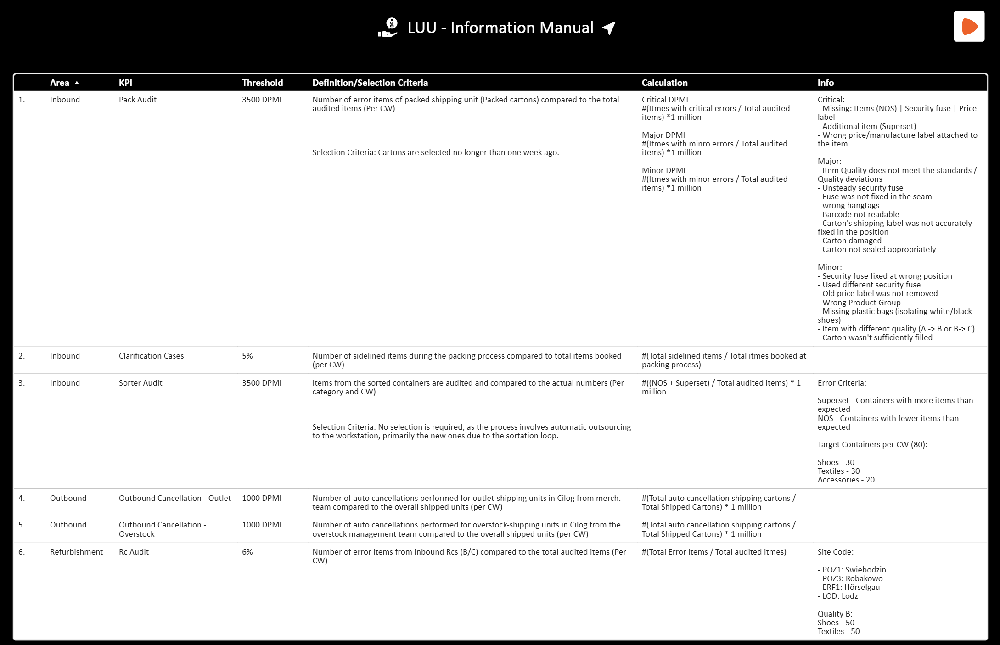

# LUU Quality Feed: Centralized Dashboard

## 📌 Project Overview
The **LUU Quality Feed** is a centralized analytics solution designed to consolidate disparate quality metrics—Inbound, Stock Accuracy, and Outbound Audits—into a single source of truth.

Previously, operational quality data was fragmented across multiple manual reports, making it difficult to gauge overall warehouse health. I designed an automated data pipeline and a unified scoring model that provides cross-functional teams with a holistic view of operational quality.

**Key Objective:** Eliminate manual reporting and provide daily, actionable quality insights for cross-functional steering meetings.

## 🏗️ Data Architecture & ETL Pipeline
To ensure data consistency, I architected a linear ETL (Extract, Transform, Load) pipeline that aggregates data from specific audit logs into a central "Quality Databank."

### The Workflow:
1.  **Extract:** Raw data is pulled from distinct operational sources (WE Audit, Stock Audit Containers, Outlet Audit, etc.).
2.  **Transform:** * Data is normalized and mapped to specific KPIs in the "Quality Databank."
    * **Logic Application:** The "Overall Score" algorithm is applied here, calculating weighted performance based on threshold adherence.
3.  **Load:** Processed data feeds into the visualization layer, populating the specific dashboard pages (Refurbishment, Inbound, Stock Accuracy, etc.).

## 📊 Dashboard & Scoring Logic

The core value of this tool is the **Dynamic Scoring Framework**. Rather than viewing metrics in isolation, the dashboard calculates a high-level "Overall Score" to give management an instant health check.

### The Logic
* **Aggregation:** Scores are derived from three core buckets: *Inbound*, *Stock Accuracy*, and *Outbound*.
* **Threshold Calculation:** A sub-process is considered "Successful" only if it meets its defined DPMI (Defects Per Million Items) threshold (e.g., <3500 DPMI).
* **Weighted Scoring:** The overall percentage is dynamically calculated based on the number of sub-processes meeting their targets (e.g., meeting 2 out of 3 targets results in a 66.7% score).
* **Visualization:** The dashboard provides drill-down capabilities, allowing users to investigate root causes (e.g., "Sorter Audit" vs. "Pack Audit" failures).

## 📘 Documentation & Data Governance
To ensure the dashboard was not just a "black box," I authored a comprehensive **Information Manual**. This documentation bridges the gap between technical logic and business users.

* **Standardization:** Clearly defines critical metrics (e.g., "Critical vs. Major DPMI") to ensure all departments speak the same language.
* **Transparency:** Details the exact calculation methods for error rates, empowering users to trust the data.
* **Self-Service:** Designed to help new team members onboard quickly without requiring constant guidance from the data team.

## 🚀 Business Impact
* **Adoption:** The dashboard is now the primary visual aid for daily operational steering meetings.
* **Efficiency:** Automated the collection of 6+ distinct data sources, saving hours of manual Excel work per week.
* **Clarity:** The "Traffic Light" logic (Green/Red indicators) allowed management to instantly identify and pivot resources to failing areas (e.g., Inbound Audit).

---

### 🛠 Tools Used
* **ETL:** Custom Pipeline (Extract/Transform/Load)
* **Visualization:** Interactive Dashboarding
* **Documentation:** Technical Writing & Process Mapping
