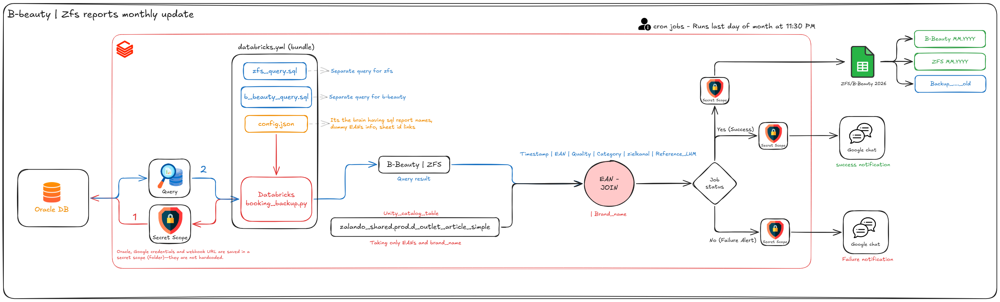

# 📊 Receive Booking Monthly Backup 
### B-Beauty & ZFS Reporting

This automation saves us time spent downloading reports, filtering them, copying and pasting, and searching for brand names associated with the respective EANs; additionally, limitations, such as those related to "libre" and 800 articles, can be pasted into Infosystem.

**Desitination:** [ZFS/B-Beauty 2026](https://docs.google.com/spreadsheets/d/1m5HO8wtLEgDHlbj7e--44ADzl9YeRNGUC8OeDEyieHc/edit?gid=697512932#gid=697512932)

## 🗺️ Pipeline

## 🚀 How it Works
The process follows four simple steps once a month:

1. **The "Wake Up" Call:** On the **last day of every month at 11:30 PM**, the script automatically starts running in the cloud.
2. **Data Extraction:** The system connects to our **Oracle Database** and pulls the full month's records for both **B-Beauty** and **ZFS** Overstock booking data.
3. **Data Cleaning & Matching:** The script automatically matches raw numbers (EANs) with their correct **Brand Names**. 
    * If a "Dummy EAN" is used, it labels it clearly (e.g., *Dummy Home B*).
    * If no brand info is found anywhere, it marks it as *“no brand info”* so there are no confusing empty cells.
4. **Google Sheets Update:** The script opens our master Google Sheet and:
    * Moves the existing data to a **Backup** tab.
    * Creates a fresh tab for the new month (e.g., *B-Beauty 05.2026*).

---

## 🏷️ Where do Brand Names come from?

* **Our Master Article Database:** The script securely links up with the central internal catalog (`zalando_shared`) to look up the official brand name registered to each barcode.
* **The Safety Catch-All:** If a product number cannot be found in the master database or our custom list, it is automatically marked as *“no brand info”* so our final sheets never have blank gaps.

---

## 📬 Staying Informed (Google Chat)
After the script finishes, it sends a summary card to our Google Chat channel.

* **✅ Success:** You will see a green card showing exactly how many rows were added for each report. It includes a button to **"Tabelle öffnen"** (Open Sheet) to take you directly to the data.
* **❌ Failure:** If something goes wrong (e.g., a database connection issue), you will see a red card. This card includes an **"SOP öffnen"** button, which links to the manual instructions on how to restart the process.

---

## 🆘 Troubleshooting
If the automated report does not appear in the Google sheet by the morning of the 1st:
1. Check the Google Chat channel for a **Failure Alert**.
2. Click the **SOP button** in the alert for step-by-step recovery instructions.
